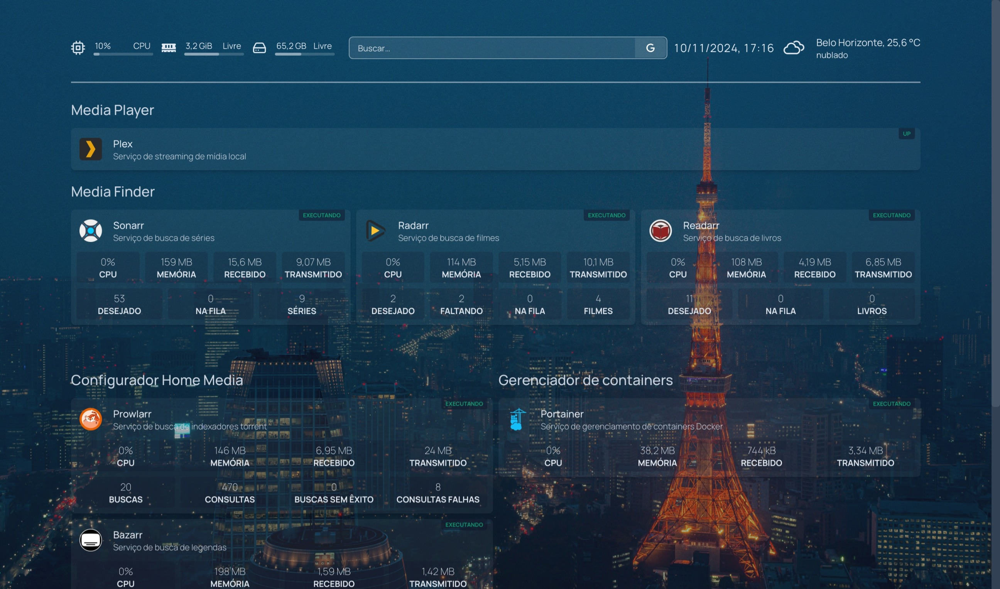

# Homepage Dashboard

Painel de aplicações que rodam na minha máquina, sejam por docker ou instaladas na fonte.

## Make Docker open its API

### Using a systemd Override File (Recommended for systemd-based systems like Ubuntu, CentOS)

1. Create or edit an override file: Use `systemctl edit` to create an override file for the `docker.service`.

```bash
sudo systemctl edit docker.service
```

2. Add the `ExecStart` line: Add the following lines to the editor that opens to override the default start command.

```ini
[Service]
ExecStart=
ExecStart=/usr/bin/dockerd -H fd:// -H tcp://0.0.0.0:2375
```

The empty `ExecStart=` is necessary to clear the default configuration before specifying the new one. 3. Save and close the file. 4. Restart Docker: Reload the systemd configuration and restart Docker.

```bash
sudo systemctl daemon-reload
sudo systemctl restart docker.service
```

---


